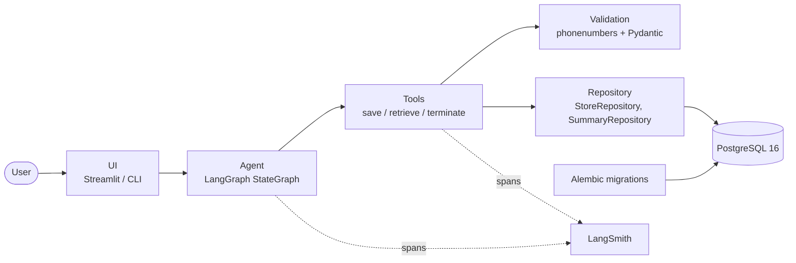
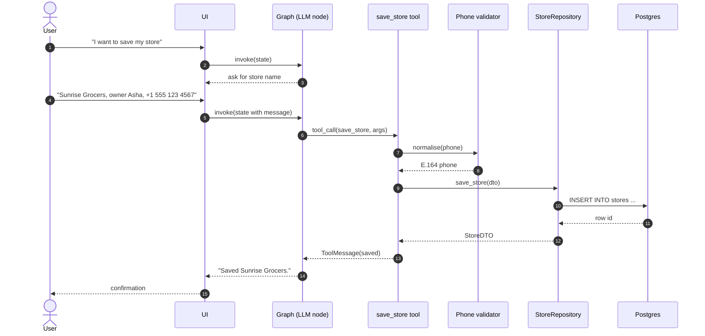
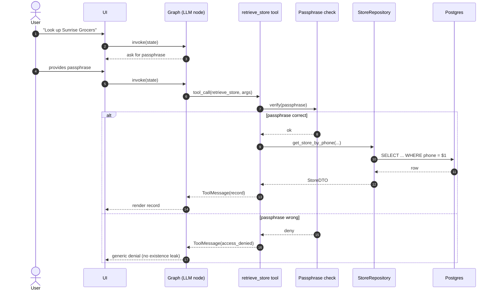
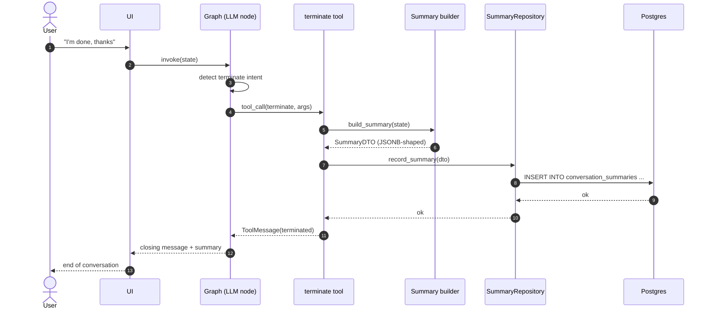
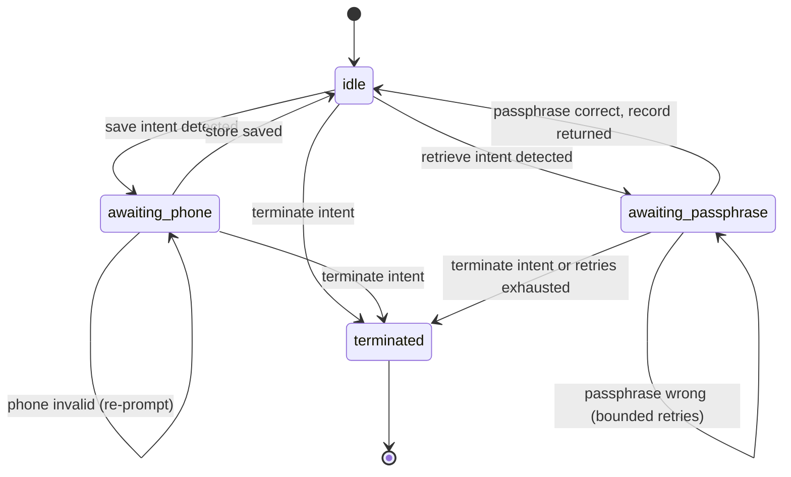

# Architecture

## Overview

The store assistant is a LangGraph-orchestrated conversational agent that captures store records (name, owner, phone) and lets owners retrieve them later behind a passphrase gate. A user speaks to the agent through Streamlit (or the CLI), the LangGraph state machine routes each turn through a reasoning node and a tool node, validators normalise input, a thin async repository persists data to PostgreSQL via SQLAlchemy 2.0, and structured traces stream to LangSmith for inspection. Schema is owned exclusively by Alembic.

## Component diagram

## Sequence — save flow (happy path)

## Sequence — retrieve flow with passphrase gate

## Sequence — termination flow

## State machine

States are slot-driven: the graph routes on `state.pending_slot` and `state.authenticated` rather than on free-text matching. The transition labels above describe intent; the actual edge predicates live in `agent/graph.py`.

## Component responsibilities

| Component | Responsibility |
|---|---|
| **UI** (`ui/streamlit_app.py`, `main.py` CLI) | Render messages, capture user input, drive one graph invocation per turn. No business logic. |
| **Agent** (`agent/graph.py`, `agent/state.py`) | Build and run the LangGraph `StateGraph`. Define nodes, edges, and the typed `AgentState`. Bound iterations via `APP_MAX_GRAPH_ITERATIONS`. |
| **Tools** (`agent/tools.py`) | `save_store`, `retrieve_store`, `terminate`. Receive Pydantic-validated arguments, call validation + repository, return structured `ToolMessage` payloads. |
| **Validation** (`validation/phone.py`, `validation/passphrase.py`) | Phone normalisation to E.164 via `phonenumbers`. Constant-time passphrase comparison against `APP_PASSPHRASE`. Reusable across tools and tests. |
| **Repository** (`data/repositories.py`) | Async, DTO-in / DTO-out persistence. Hides SQLAlchemy from agent code. Single place for query optimisation. |
| **Database** (Postgres 16) | Source of truth. Owned exclusively by Alembic. Schema changes never originate elsewhere (see ADR-009). |
| **Migrations** (`alembic/`) | All DDL, plus required reference data and extension creation. Async config in `alembic/env.py`, URL sourced from `Settings`. |
| **Config** (`config.py`) | `Settings` Pydantic model loading from `.env` and the environment. Single typed entrypoint for every secret and tunable. |
| **Tracing** (LangSmith callback) | Optional. Enabled by `LANGSMITH_TRACING=true`. No application code change to opt in. |

## Tech stack

- **Language**: Python 3.11
- **Dependency manager**: uv
- **LLM orchestration**: LangGraph; LangChain for tools, prompts, and the model client
- **LLM**: Anthropic Claude Sonnet 4.5 via `langchain-anthropic`; configurable via `APP_LLM_MODEL`
- **Database**: PostgreSQL 16 (Docker, `postgres:16-alpine`)
- **DB access**: SQLAlchemy 2.0 async + asyncpg
- **Migrations**: Alembic (async template)
- **Validation / settings**: Pydantic v2 + pydantic-settings
- **Phone normalisation**: `phonenumbers`
- **UI**: Streamlit
- **Logging**: structlog
- **Tracing**: LangSmith (development); Langfuse / OpenTelemetry planned for production
- **Testing**: pytest, pytest-asyncio, pytest-cov, pytest-mock
- **Quality / security**: ruff, mypy (strict), bandit, pip-audit
- **Runtime packaging**: multi-stage Dockerfile, non-root user, named volume only
